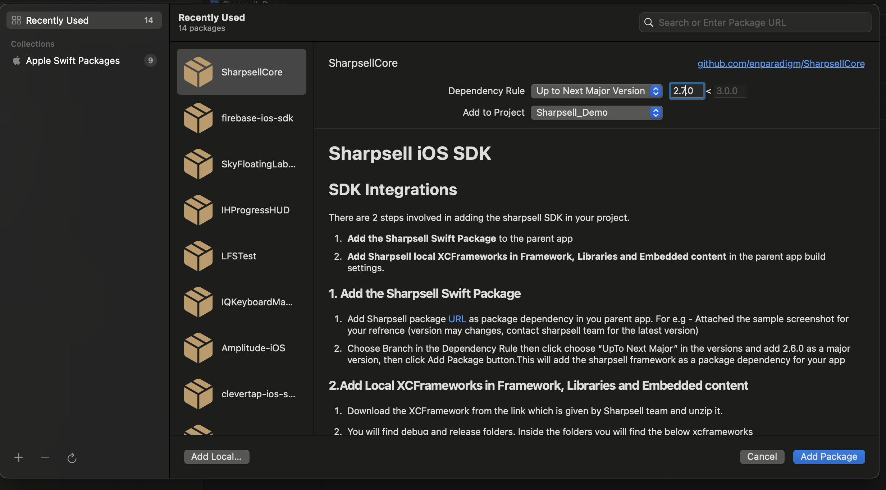

# Sharpsell iOS SDK

## Pre-Requisites

1. Minimum iOS version supported by sharpsell is iOS `12.0`

2. Firebase should be enabled and the `GoogleService-Info.plist` file should be properly setup.

:::tip Firebase setup
Firebase setup have to be done in order to enable push notification and analytics on sharpsell SDK.
To setup iOS firebase setup follow this - https://firebase.google.com/docs/ios/setup
:::

## Needed User Permissions

Sharpsell needs some user permissions like gallery, camera access etc, in order to use the desierd items on the app for variuos features. Permission will be asked only before accessing it.

Below we have mentioned what all the permissons will be needed and reason for that.

<details>
<summary><b>Privacy - Camera Usage Description</b></summary>
We need to access user's camera to set profile picture, set images in presentations, and record videos for Roleplay challenges. 
</details>

<details>
<summary><b>Privacy - Photo Library Usage Description</b></summary>
We need to access user's photo library to set profile picture, set images in prodcut presentations and record videos for Roleplay challenges. 
</details>

<details>
<summary><b>Privacy - Microphone Usage Description</b></summary>
We need to access user's microphone to record audiod on a videos for roleplay challenges.
</details>

<details>
<summary><b>Privacy - Contacts Usage Description</b></summary>
We want permission to access your camera to set profile picture, set images in presentations, and record videos for Roleplay challenges. 
</details>

<details>
<summary><b>LSApplicationQueriesSchemes</b></summary>

Add <b>whatsapp</b> in the array of qurery scheme

We need this Application Queries Schemes to open whatsapp to send message to customer on click of whatsapp share button.

</details>

:::warning Adding user permission in info.plist
We need to add all the above user permission on you info.plist file. If not you may get rejections while updloading th app to app store connect.

Please go thorught the sample app info.plist file, if you want some examples on how to add these permission on iOS
:::

## Installation

There are 2 steps involved in adding the sharpsell SDK in your project.

1. **Add the Sharpsell Swift Package** to the parent app
2. **Add Sharpsell local XCFrameworks in Framework, Libraries and Embedded content** in the parent
   app build settings.

### 1. Add the Sharpsell Swift Package

1. Add Sharpsell package [URL](https://github.com/enparadigm/SharpsellCore.git) as package
   dependency in you parent app.
   For e.g - Attached the sample screenshot for your refrence (version may changes, contact sharpsell team for the latest version)

   ```swift title="Sharpsell SDK swift package URL"
   https://github.com/enparadigm/SharpsellCore.git
   ```

   


2. Choose Branch in the Dependency Rule then click choose "UpTo Next Major" in the versions and add **2.7.0** as a major version,
   then click Add Package button.This will add the sharpsell framework as a package dependency for
   your app

### 2.Add Local XCFrameworks in Framework, Libraries and Embedded content

1. Download the XCFramework from the link which is given by Sharpsell team and unzip it.

2. You will find debug and release folders. Inside the folders you will find the below xcframeworks

   - App.xcframework
   - Flutter.xcframework
   - FBLPromises.xcframework
   - FMDB.xcframework


3. In order to run in iOS Simulators, we need to use debug version.So, if you are testing the app in
   simulator then use XCFramrworks which is available in Debug Folder.

4. Use XCFrameworks which is in Release folder when sharing a build or release the app to the app
   store. Debug frameworks will be slower compare with release framework.

5. Drag and drop all four XCFramework in **Framework, Libraries and Embedded content** section in
   project settings for your app target. All the frameworks will be added as **Embed & Sign**
   framework by default.

Make sure all other framework are in **Embed & Sign** .

:::note
Use Debug frameworks only for testing on simulators. Debug frameworks will be bit laggy compare to release framewoks
Use Release frameworks while pushing to app store and testfligt.
:::

## Testing sharpsell in iOS Simulators

In order to run in iOS Simulators, we need to use debug version.So, if you are testing the app in
simulator then use XCFramrworks which is available in Debug Folder and replace those into the
project as mentioned above.

:::danger Use Release framework for release build

Make sure we are using release frameworks when sharing a build or release the app to the
app store. Debug frameworks will be slower compare with release framework.

:::
