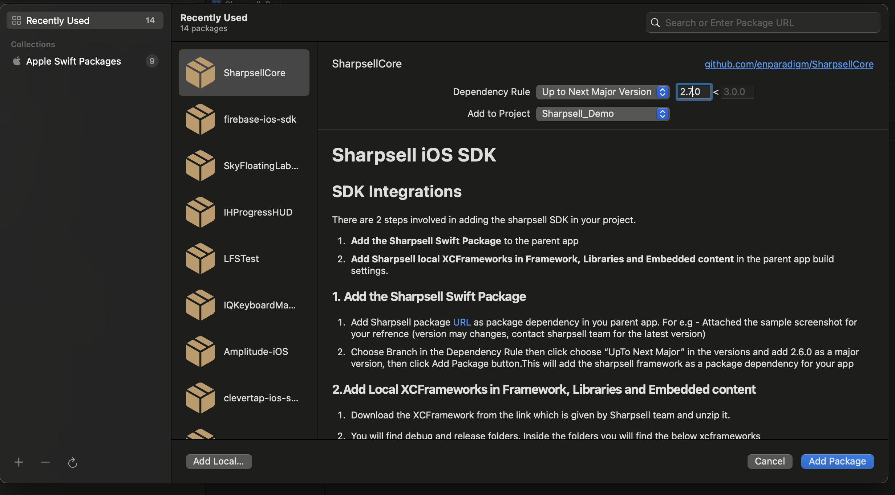

import ReactPlayer from 'react-player';


# Sharpsell iOS SDK


<ReactPlayer playing controls url='/videos/iOS_setup.mp4'/>


## Pre-Requisites

1. Xcode 14.1 or later.

2. The minimum iOS version supported by Sharpsell is iOS `13.0`

3. Firebase should be enabled and the `GoogleService-Info.plist` file should be properly setup.

:::tip Firebase setup
Firebase setup have to be done to enable push notification and analytics on Sharpsell SDK.
To set up iOS firebase setup follow this - https://firebase.google.com/docs/ios/setup
:::

## Needed User Permissions

Sharpsell needs some user permissions like gallery, camera access etc, to use the desired items on the app for various features. Permission will be asked only before accessing it.

<b>All mentioned keys are expected to be added in on info.plist file. <b>

Below we have mentioned what all the permissions will be needed and the reason for that.

<details>
<summary><b>Privacy - Camera Usage Description</b></summary>
We need to access the user's camera to set the profile picture, set images in presentations, and record videos for Roleplay challenges. 
</details>

<details>
<summary><b>Privacy - Photo Library Usage Description</b></summary>
We need to access the user's photo library to set a profile picture, set images in product presentations and record videos for Roleplay challenges. 
</details>

<details>
<summary><b>Privacy - Microphone Usage Description</b></summary>
We need to access the user's microphone to record audio on a video for roleplay challenges.
</details>

<details>
<summary><b>Privacy - Contacts Usage Description</b></summary>
We want permission to access your camera to set your profile picture, set images in presentations, and record videos for Roleplay challenges. 
</details>

<details>
<summary><b>LSApplicationQueriesSchemes</b></summary>
Below are the two queery scheme expected to be added in the LSApplicationQueriesSchemes

<b>whatsapp</b>
<b>sharpsell</b>

Add <b>whatsapp</b> to the array of query scheme

We need this Application Queries Schemes to open WhatsApp to send messages to customers with the click of the WhatsApp share button.

Add <b>sharpsell</b> to the array of query scheme

We need this Application Queries Schemes for deeplink to work in the integrated app.

</details>

:::warning Adding user permission in info.plist
We need to add all the above user permission to your `info.plist` file. If not you may get rejections while updloading the app to the AppStore connect.

Please go through the sample app info.plist file, if you want some examples of how to add this permission on iOS
:::

## Adding Associated domains

We need add the our domain name to make the deeplink work in the integrated app.

To add the associated domain follow the below steps,
1. Natvigate to your target and click on Signing & Capabilities 
2. Click on (+ Capability) button and once it is clicked it will add the Associated domain.
3. In Associated domain, click on the (+) button. And the given applink domain name in the text box and click on enter.

:::note
Sharpsell team will provide you the domain name which needs to be added in the associated domain
:::


## Installation

There are 2 steps involved in adding the Sharpsell SDK to your project.

1. **Add the Sharpsell Swift Package** to the parent app
2. **Add Sharpsell local XCFrameworks in Framework, Libraries and Embedded content** in the parent
   app build settings.

### 1. Add the Sharpsell Swift Package

1. Add Sharpsell package [URL](https://github.com/enparadigm/SharpsellCore.git) as a package
   dependency in your parent app.
   For e.g - Attached the sample screenshot for your reference (the version may changes, contact the Sharpsell team for the latest version)

   ```swift title="Sharpsell SDK swift package URL"
   https://github.com/enparadigm/SharpsellCore.git
   ```

   


2. Choose Branch in the Dependency Rule then click choose "UpTo Next Major" in the versions and add **2.7.0** as a major version,
   then click Add Package button. This will add the Sharpsell framework as a package dependency for
   your app

### 2. Add Local XCFrameworks in Framework, Libraries and Embedded content

1. Download the XCFramework from the link which is given by the Sharpsell team and unzip it.

2. You will find debug and release folders. Inside the folders, you will find the below XCframeworks

   - App.xcframework
   - Flutter.xcframework
   - FBLPromises.xcframework
   - FMDB.xcframework


3. To run in iOS Simulators, we need to use debug version. So, if you are testing the app in the simulator then use XCFramrworks which is available in Debug Folder.

4. Use XCFrameworks which is in the Release folder when sharing a build or releasing the app to the app
   store. Debug frameworks will be slower compared with release frameworks.

5. Drag and drop all four XCFramework in **Framework, Libraries and Embedded content** section in
   project settings for your app target. All the frameworks will be added as **Embed & Sign** 
   frameworks by default.

Make sure all other frameworks are in **Embed & Sign**.

:::note
Use Debug frameworks only for testing on simulators. Debug frameworks will be a bit laggy compared to release frameworks
Use Release frameworks while pushing to the app store and test flight.
:::

## Testing Sharpsell in iOS Simulators

To run in iOS Simulators, we need to use debug version. So, if you are testing the app in the simulator then use XCFramrworks which is available in Debug Folder and replace those into the
project as mentioned above.

:::danger Use Release framework for release build

Make sure we are using release frameworks when sharing a build or release the app to the
app store. Debug frameworks will be slower compared with release frameworks.

:::
